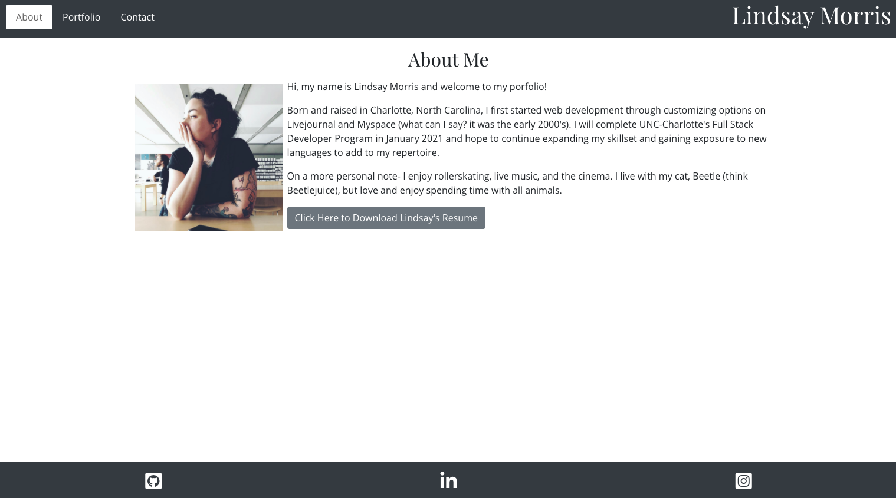
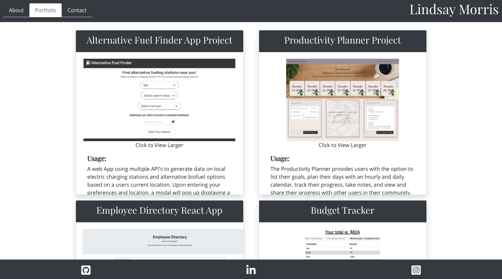
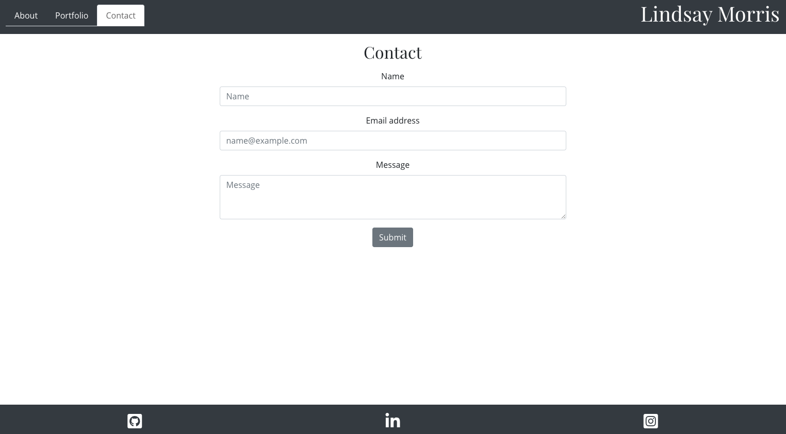

# React Portfolio Homework

## Table of Contents:
*[Description](#description)  
*[Links](#links)  
*[Images](#images)  
*[Installation](#installation)  
*[Usage](#usage)  
*[License](#license)  
*[Contribute](#contribute)  
*[Tests](#tests)  
*[Questions](#questions)  

## DESCRIPTION:

Update your portfolio and other materials to build toward being employer competitive. Creating a portfolio using React will help set you apart from other developers whose portfolios do not use some of the latest technologies.

## LINKS:

[Deployed Site](https://lindsaymorris813.github.io/reactPortfolio/)  

[GitHub Repository](https://github.com/lindsaymorris813/reactPortfolio)  

## IMAGES:

## INSTALLATION

React  
Bootstrap  
React-Router-DOM  
GitHub Pages  

## USAGE

A place for potential employers and clients can view information about me, view and interact with my projects, and contact me.

## LICENSE

N/A

## CONTRIBUTE

Used npx create-react-app for base code and file organization.

## TESTS

N/A

## QUESTIONS

GitHub: [lindsaymorris813](https://github.com/lindsaymorris813)  
Email: lindsaymorris813@gmail.com